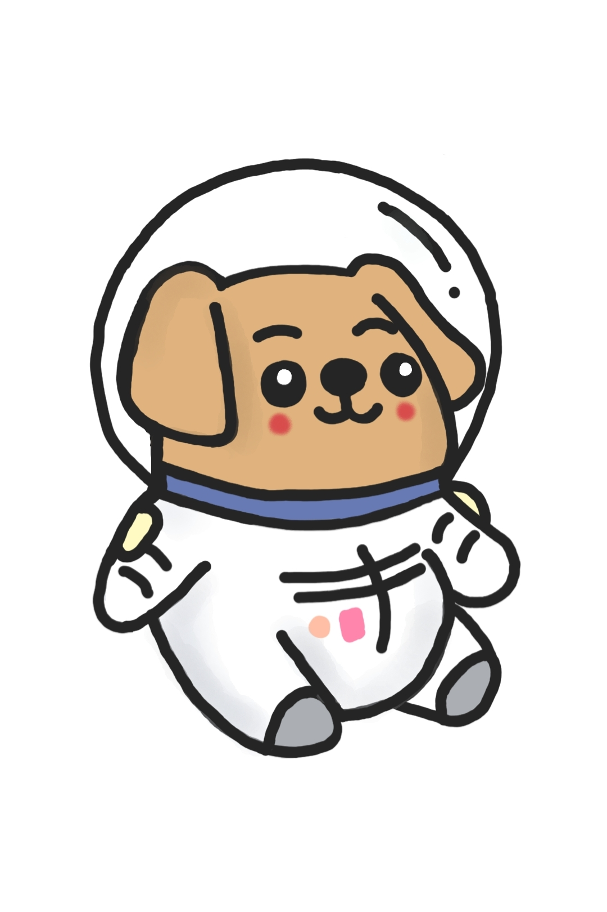

# PetSpace Backend API Server

> 이 성과는 전국 대학생 IT 연합동아리 'University Makeus Challenge' 3기에서 진행한 프로젝트의 결과입니다. 
>   
> This achievement is the result of a project conducted during the 3rd edition of the University Makeus Challenge.

## 목차

- [1. 프로젝트 개요](#1-프로젝트-개요)
    - [1-1. 프로젝트 소개](#1-1-프로젝트-소개)
    - [1-2. 시스템 구성도](#1-2-시스템-구성도)
    - [1-3. 주요 기능](#1-3-주요-기능)
    - [1-4. 개발 환경](#1-4-개발-환경)
- [2. 개발 결과물](#2-개발-결과물)
    - [2-1. 백엔드 아키텍처](#2-1-백엔드-아키텍처)
    - [2-2. AWS 아키텍처](#2-2-aws-아키텍처)
    - [2-3. 데이터베이스 ERD 및 RDB 구조](#2-3-데이터베이스-erd-및-rdb-구조)
    - [2-4. API 서버 개발 및 API 문서화/테스트](#2-4-api-서버-개발-및-api-문서화테스트)
    - [2-5. API 서버 단위 테스트 및 테스트 커버리지](#2-5-api-서버-단위-테스트-및-테스트-커버리지)
    - [2-6. API 서버 리팩토링](#2-6-api-서버-리팩토링)
    - [2-7. API 서버 CI/CD 파이프라인](#2-7-api-서버-cicd-파이프라인)
- [3. 수행 방법 및 프로젝트 관리](#3-수행-방법-및-프로젝트-관리)
    - [3-1. 개발 프로세스](#3-1-개발-프로세스)
    - [3-2. 형상 관리 프로세스](#3-2-형상-관리-프로세스)
    - [3-3. 리팩토링 문화](#3-3-리팩토링-문화)

## 1. 프로젝트 개요

### 1-1. 프로젝트 소개

